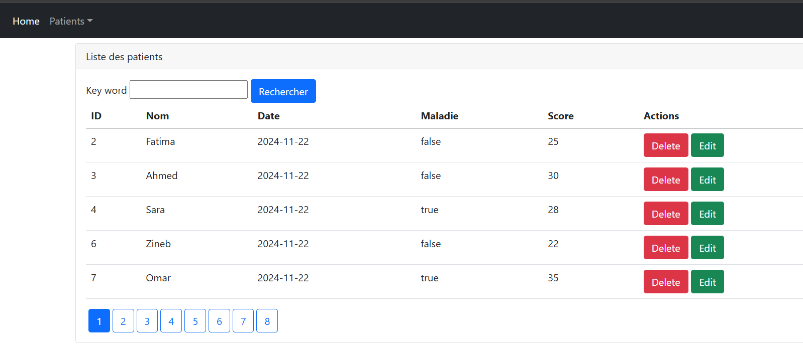
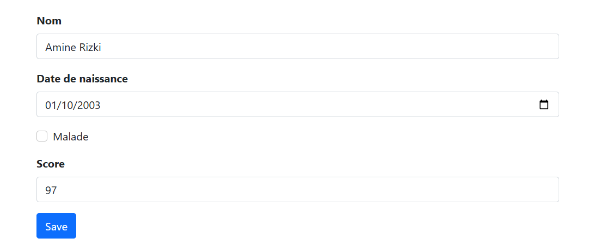
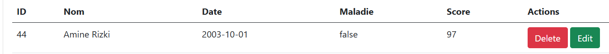
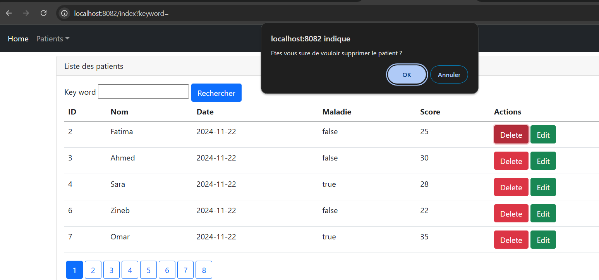
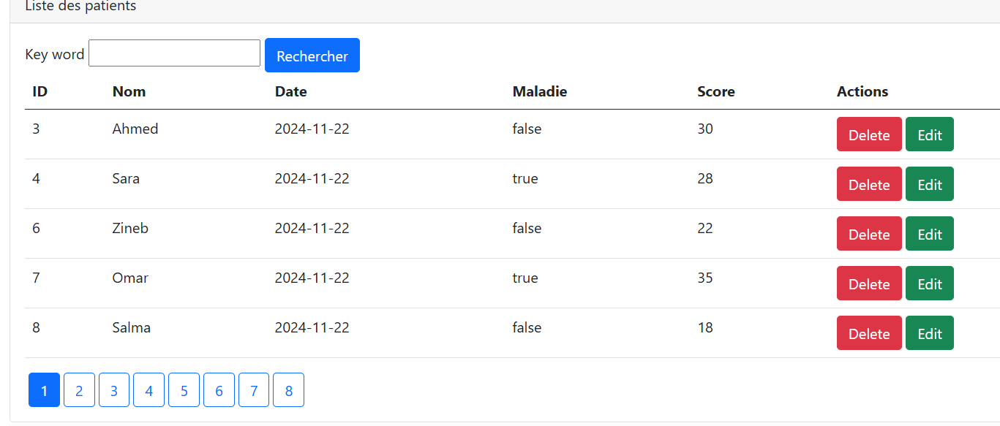
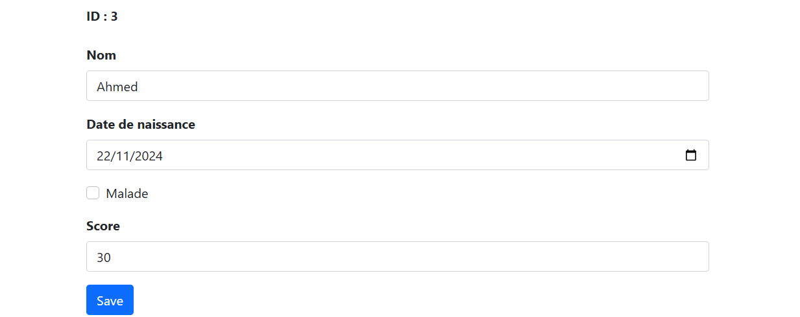
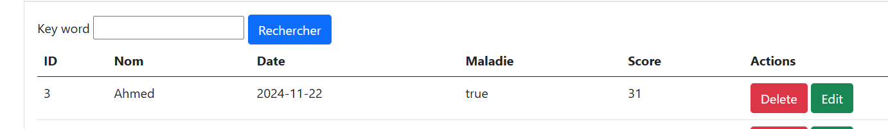
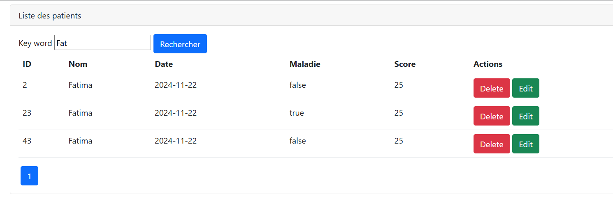
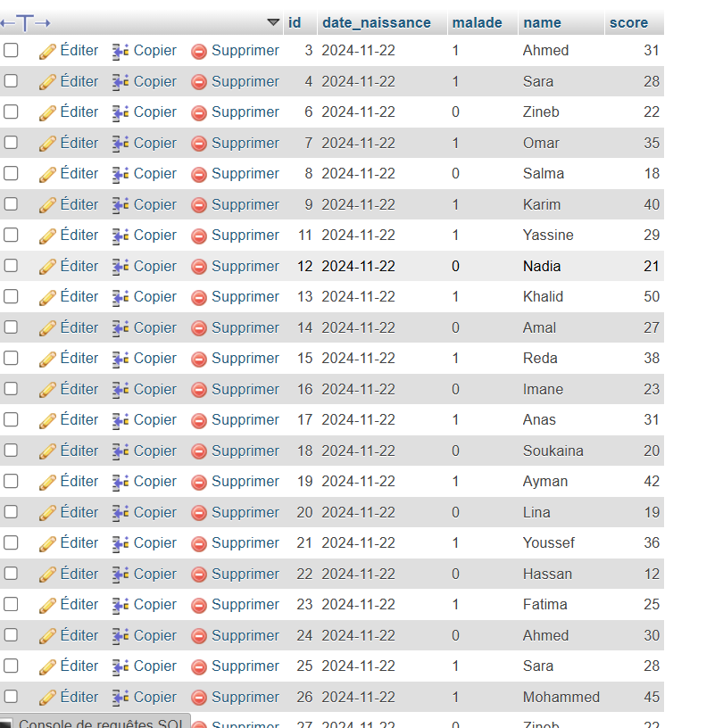

# Projet de Gestion des Patients

Ce projet consiste à gérer une base de données de patients à l'aide d'une application Spring Boot. L'application permet d'afficher, ajouter, supprimer, modifier et rechercher des patients.

## Fonctionnalités
- Affichage de tous les patients
- Ajout de patients
- Suppression de patients
- Modification de patients
- Recherche par nom

## Affichage de tous les patients
Avant tout ajout de patients, l'affichage des patients enregistrés dans la base de données est montré ci-dessous.

## Avant ajout
Voici l'état de la liste des patients avant l'ajout de nouveaux patients.

## Après ajout
Voici l'état de la liste des patients après l'ajout de nouveaux patients.

## Avant suppression
Avant la suppression d'un patient, voici l'affichage des patients enregistrés.

## Après suppression
Après avoir supprimé un patient, voici l'état de la liste des patients.

## Avant modification
Avant toute modification, voici la liste des patients dans la base de données.

## Après modification
Voici la liste des patients après modification des informations d'un patient.

## Recherche par nom
La recherche par nom permet de trouver un patient spécifique. Voici un exemple de recherche d'un patient par nom.

## Affichage dans la BDD :

## Technologies utilisées
- **Spring Boot** : Framework pour le développement backend
- **Spring Data JPA** : Pour l'accès à la base de données
- **H2 Database** : Base de données en mémoire utilisée pour la gestion des patients
- **Thymeleaf** : Template engine pour l'affichage HTML
- **Lombok** : Pour simplifier la création des beans et réduire le code
